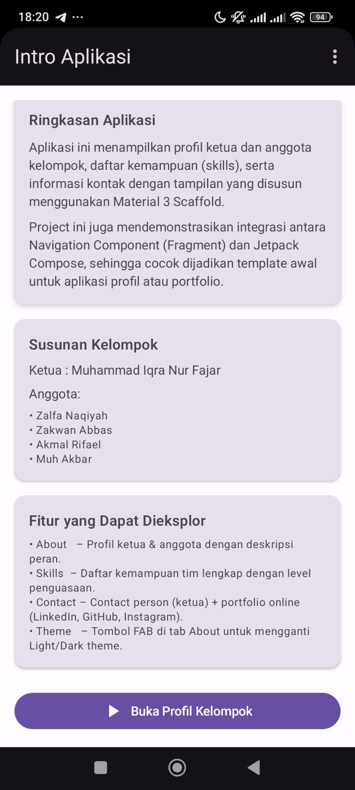
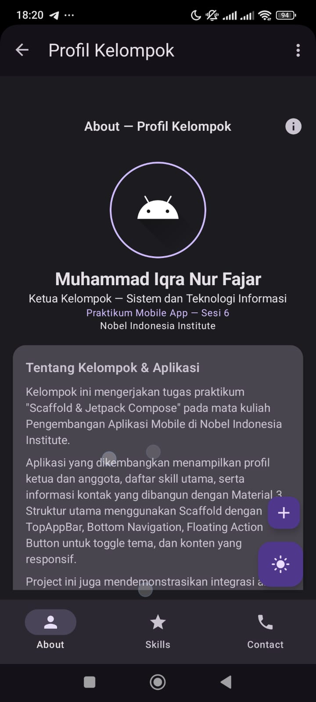
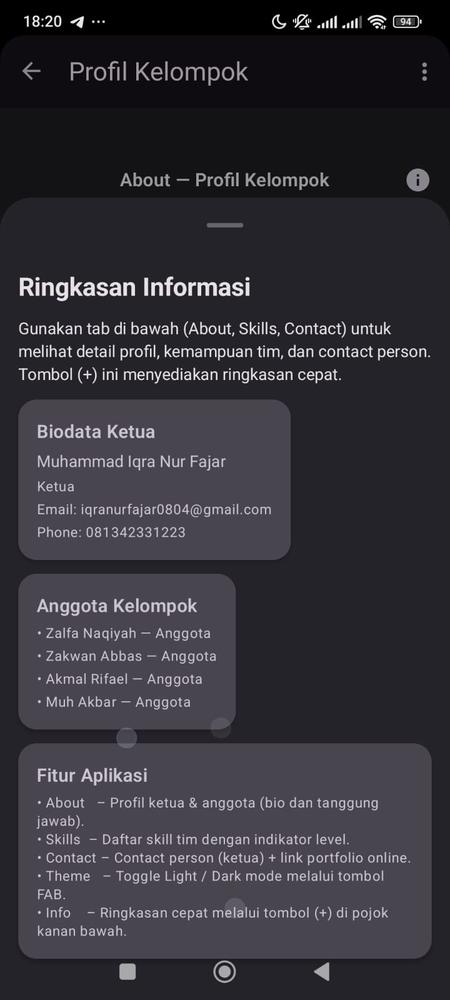
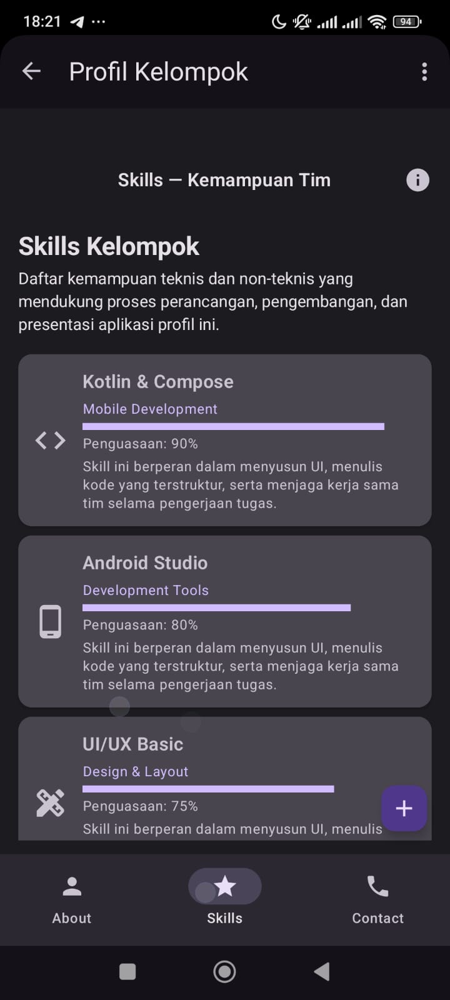
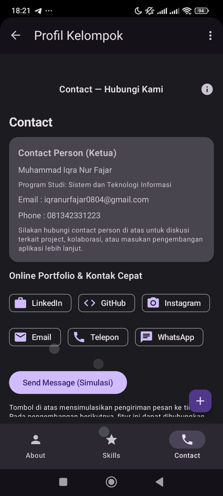

# Profil Kelompok – Praktikum Mobile App (Sesi 6)

Aplikasi Android untuk menampilkan **profil ketua & anggota kelompok**, daftar **skills**, serta **informasi kontak & portfolio online**.  
Project ini dibuat untuk tugas **Praktikum Mobile Application (Sesi 6)**  
**Program Studi Sistem dan Teknologi Informasi – Nobel Indonesia Institute**.

---

## 📲 Preview Aplikasi

Semua screenshot disimpan di folder [`docs`](docs) bersama file APK.

### 1. Intro Aplikasi (`docs/01_intro_aplikasi.png`)



Halaman pembuka yang menjelaskan:
- Ringkasan aplikasi dan teknologi yang digunakan (Navigation Component + Jetpack Compose + Material 3 Scaffold).
- Susunan ketua & anggota kelompok.
- Fitur utama yang bisa dieksplor (About, Skills, Contact, Theme).
- Tombol CTA **“Buka Profil Kelompok”** untuk masuk ke halaman utama.

---

### 2. About – Profil Kelompok



Halaman utama profil:
- Menampilkan **nama ketua** dan informasi:
  - Program studi, kelas praktikum, dan kampus.
- Menggunakan **avatar melingkar** dengan aksen warna ungu.
- Card **“Tentang Kelompok & Aplikasi”** yang menjelaskan konteks tugas dan teknologi:
  - Scaffold, TopAppBar, Bottom Navigation, Floating Action Button (FAB), dan integrasi Fragment + Compose.
- FAB di kanan bawah untuk:
  - Toggle **Light / Dark mode**.
  - Tombol **(+)** untuk membuka ringkasan informasi cepat.

---

### 3. About – Ringkasan Informasi



Bottom sheet **Ringkasan Informasi** yang muncul setelah menekan tombol **(+)**:
- **Biodata Ketua**  
  Nama, peran (Ketua), email, dan nomor telepon.
- **Anggota Kelompok**  
  Daftar nama anggota beserta perannya.
- **Fitur Aplikasi**  
  Ringkasan singkat:
  - About → Profil ketua & anggota (bio + tanggung jawab).
  - Skills → Daftar kemampuan tim dengan indikator level.
  - Contact → Contact person + portfolio online.
  - Theme → Toggle Light/Dark mode via FAB.
  - Info → Ringkasan cepat via tombol (+).

Bagian ini memudahkan dosen atau reviewer membaca “overview” aplikasi tanpa harus berpindah tab satu per satu.

---

### 4. Skills – Kemampuan Tim



Halaman **Skills** menampilkan daftar kemampuan teknis dan non-teknis:

- Menggunakan `LazyColumn` dengan **Card** untuk setiap skill.
- Setiap card berisi:
  - Nama skill (misal: Kotlin & Compose, Android Studio, UI/UX Basic).
  - Kategori (Mobile Development, Development Tools, Design & Layout, dll).
  - **LinearProgressIndicator** sebagai indikator level penguasaan (%).
  - Deskripsi singkat peran skill tersebut dalam pengerjaan project.

Halaman ini cocok sebagai **visualisasi kompetensi tim** ketika project dijadikan portfolio.

---

### 5. Contact – Hubungi Kami



Halaman **Contact** berisi:

- **Contact Person (Ketua)**
  - Nama: Muhammad Iqra Nur Fajar  
  - Program Studi: Sistem dan Teknologi Informasi  
  - Email: `iqranurfajar0804@gmail.com`  
  - Phone: `081342331223` (WhatsApp)

- **Online Portfolio & Kontak Cepat**
  - Tombol **LinkedIn**, **GitHub**, dan **Instagram** yang disiapkan untuk membuka:
    - LinkedIn: `https://www.linkedin.com/in/muhammad-iqra-nur-fajar-669829299`
    - GitHub: `https://github.com/iqraa07`
    - Instagram: `https://www.instagram.com/qraaaaa_`
  - Tombol quick actions:
    - Email (bisa diarahkan ke intent email),
    - Telepon,
    - WhatsApp (`https://wa.me/6281342331223`).

- Tombol **“Send Message (Simulasi)”**  
  Saat ini akan menampilkan Snackbar sebagai simulasi pengiriman pesan.  
  Di pengembangan selanjutnya bisa dihubungkan ke **email/WA/backend API**.

---

## 👥 Anggota Kelompok

- **Ketua**: **Muhammad Iqra Nur Fajar**  
  Sistem dan Teknologi Informasi – Nobel Indonesia Institute  
  - LinkedIn: [linkedin.com/in/muhammad-iqra-nur-fajar-669829299](https://www.linkedin.com/in/muhammad-iqra-nur-fajar-669829299)  
  - GitHub: [github.com/iqraa07](https://github.com/iqraa07)  
  - Instagram: [@qraaaaa_](https://www.instagram.com/qraaaaa_)  
  - Email: `iqranurfajar0804@gmail.com`  
  - WhatsApp: [`wa.me/6281342331223`](https://wa.me/6281342331223)

- **Anggota**:
  - Zalfa Naqiyah – fokus UI/UX & penyusunan tampilan.
  - Zakwan Abbas – fokus navigasi & alur logika aplikasi.
  - Akmal Rifael – fokus kualitas kode & dokumentasi teknis.
  - Muh Akbar – fokus pengujian tampilan dan persiapan demo/presentasi.

---

## ✨ Fitur Utama Aplikasi

- **Fragment + Compose Integration**
  - `FirstFragment` → Intro Aplikasi.
  - `SecondFragment` → host untuk `ProfileApp()` (Jetpack Compose).

- **ProfileApp (Jetpack Compose + Material 3)**
  - `Scaffold` dengan:
    - `CenterAlignedTopAppBar` (title dinamis per tab + tombol Info).
    - `NavigationBar` (About, Skills, Contact).
    - FAB:
      - Toggle **Light / Dark theme**.
      - Tombol **(+)** untuk menampilkan ringkasan informasi.

- **About Screen**
  - Profil ketua + detail kelompok.
  - FilterChip untuk memilih anggota dan melihat bio + tanggung jawab masing-masing.
  - Ringkasan aplikasi dan teknologi yang digunakan.

- **Skills Screen**
  - Daftar skills dengan indikator progress dan deskripsi singkat.

- **Contact Screen**
  - Contact person (ketua) + social link (LinkedIn, GitHub, Instagram).
  - Tombol quick actions (Email, Telepon, WhatsApp).
  - Simulasi pengiriman pesan via Snackbar.

---

## 🛠️ Tech Stack Singkat

- **Bahasa**: Kotlin
- **UI**: Jetpack Compose + Material 3
- **Navigation**: Navigation Component (Fragments) + Composable Content
- **Min SDK**: 24  
- **Theme**: Light / Dark dengan `MaterialTheme` dan `darkColorScheme()` / `lightColorScheme()`

---

## 📦 Download APK

APK build (debug/release) disimpan di folder [`docs/`](docs):

- [`docs/profil-kelompok-sesi6.apk`](docs/profil-kelompok-sesi6.apk)

File ini bisa dipindahkan ke device Android dan diinstall untuk mencoba aplikasi secara langsung.

---

## ▶️ Cara Menjalankan Project

1. Clone repository:

   ```bash
   git clone https://github.com/iqraa07/NAMA-REPO-KAMU.git
   cd NAMA-REPO-KAMU
